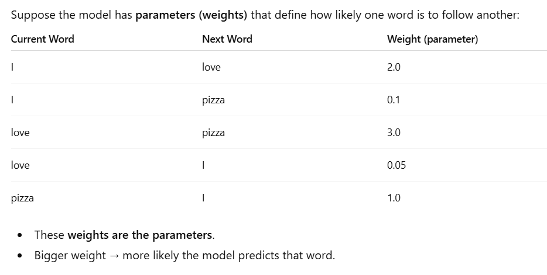
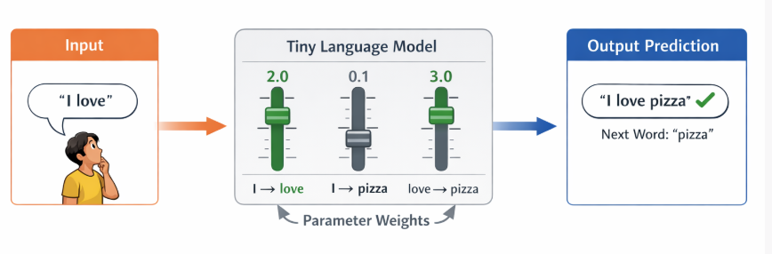
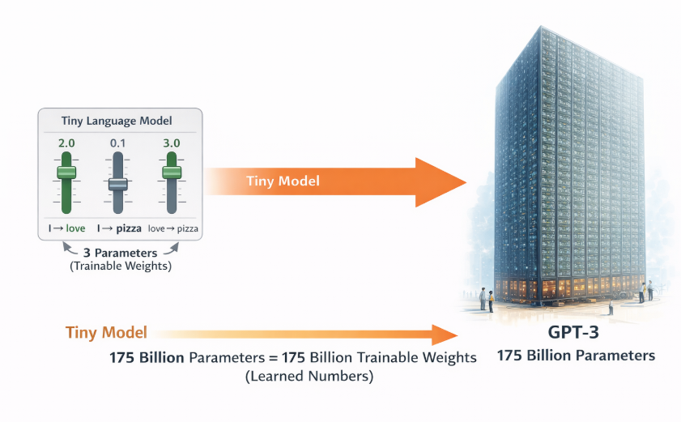

Parameters in Neural Networks:  
```
Input x → weight w → output y = x * w  

Here, w is a parameter. Changing it changes the output.  
During training, the network learns the best values for these parameters so it can perform the task well  
```



 



